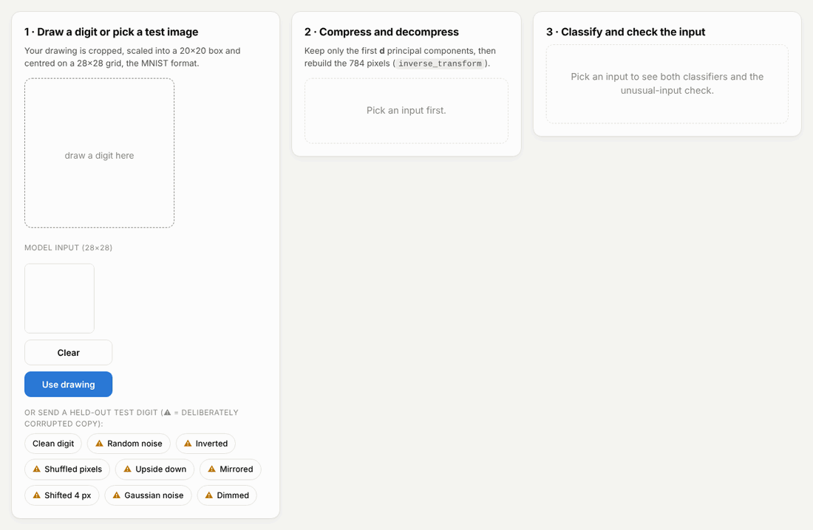
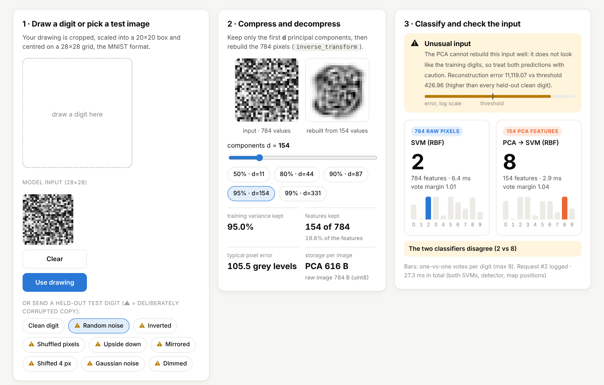
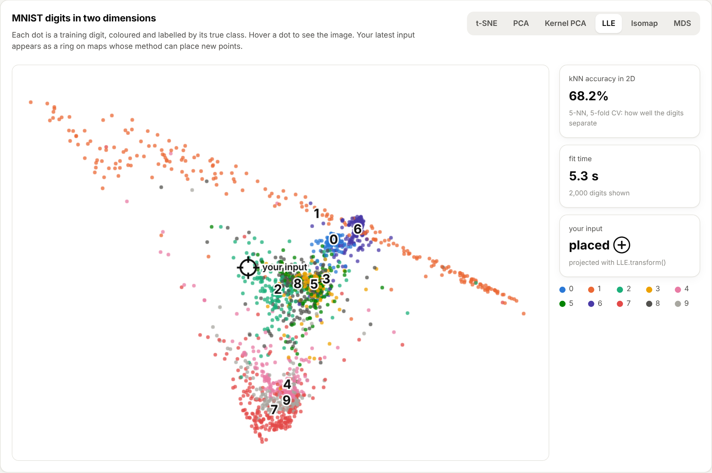
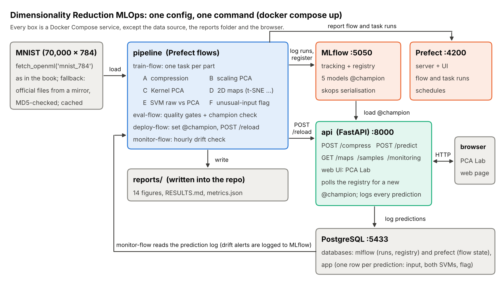

<h1 align="center">Dimensionality Reduction MLOps</h1>

<p align="center"><b>PCA, Randomized/Incremental PCA, Kernel PCA, LLE and t-SNE on 70,000 MNIST digits, from notebook to monitored service, with one config and one command.</b></p>

<p align="center">
  <a href="https://github.com/ToMooGo/dimensionality-reduction-mlops/actions/workflows/ci.yml"></a>
  
  
  
  
  
</p>

<p align="center"></p>
<p align="center"><sub>The web app (PCA Lab). A drawn digit is stored as a few principal components and rebuilt; two SVMs classify it, one on the raw pixels and one on the PCA features; the reconstruction error says whether the input looks like a digit at all.</sub></p>

### TL;DR

- **Problem.** Images with 784 values each are slow to train on, costly to store and impossible to look at.
- **Result.** Keeping 154 values per image (95% of the pixel variance) made an SVM train **2.6× faster** and predict **2.7× faster**, with no loss of accuracy (97.0% → 97.5% on 10,000 test digits). A 2D t-SNE map separates the digits as well as all 784 pixels do.
- **Bonus.** The same compression flags inputs that are not digits, with 3.3% false alarms on real digits.

Everything runs on a laptop with **`make up`** (Docker), with no GPU and no cloud account. For a short version, `make up-quick` trains on a 10,000-image subset in a few minutes.

> **Beyond the book.** The methods come from Géron, *Hands-On Machine Learning* (2nd ed.), Chapter 8. These findings do not:
> - `IncrementalPCA.fit()` on a memory-mapped file silently copies the whole array into RAM. Feeding slices to `partial_fit` gives the same components with **24× less memory** than a full SVD (24 MB vs 569 MB).
> - The two Kernel PCA tuning rules disagree. Lowest reconstruction error picks a nearly linear kernel, which reaches **73.6%** on held-out points against **96.4%** for the supervised choice. The report explains why.
> - Most of the SVM's accuracy gain with PCA comes from the kernel width that the default `gamma` implies on the new features. With the width held fixed, only +0.12 pp remains. The speed-up is real either way.
> - PCA makes a Random Forest **2.4× slower** and 2.1 pp less accurate.
> - The detector has a blind spot that follows from the maths: a faint digit is *never* flagged, because dimming an image by α scales its error by about α².

**Why it matters beyond digits.** Any data set with hundreds of correlated columns, such as sensor readings, spectra or image pixels, has the same three problems. Compression cuts storage and training cost, and a 2D map lets people see structure. The reconstruction error can raise an alert when incoming data stops looking like the training data. This project measures what each step gains and what it costs.

| | Question | Method | Result |
|---|---|---|---|
| **A** | How far can PCA compress MNIST? | Smallest *d* keeping 95% of the variance; `inverse_transform` | **154 of 784 features (19.6%)** keep **95.0%** of the training variance, and 95.1% of the test variance |
| **B** | Can PCA run on data that doesn't fit in RAM? | Randomized PCA, Incremental PCA, `np.memmap` | Same subspace within **0.8%** reconstruction error. Out-of-core training peaks at **24 MB vs 569 MB** |
| **C** | How do you tune Kernel PCA? | `GridSearchCV` over **20 kernel/γ settings** vs lowest pre-image error (Swiss roll, 25% held out) | Supervised choice **96.4%** held-out accuracy (linear PCA 75.2%); the unsupervised rule picks a different kernel (73.6%). The book's pre-image error **32.786** is reproduced exactly |
| **D** | Which 2D map shows MNIST best? | t-SNE vs PCA, Kernel PCA, LLE, Isomap, MDS, scored by kNN accuracy in 2D | **t-SNE 93.3%**, on a par with kNN on all 784 pixels (92.8%); PCA 41.4%, LLE 68.2% |
| **E** | Does compression speed up classification? | Exercise 9: Softmax, Random Forest, RBF SVM, each on raw pixels vs PCA features | SVM: **2.6× faster training, 2.7× faster prediction**, 97.01% → 97.48% (+0.47 pp, 95% CI +0.31 to +0.63). Random Forest: 2.4× *slower*, −2.1 pp |
| **F** | Can PCA flag inputs that aren't digits? | Reconstruction error; flag the worst 4% (book, Ch. 9) | **3.3% false alarms** (95% CI 3.0–3.7%). Catches **100%** of four synthetic corruptions and 90% of shifted digits; misses dimmed digits |

### When does dimensionality reduction pay off?

| Situation | What this project measured | Advice |
|---|---|---|
| A kernel model (SVM) on many features | 2.6× faster training, 2.7× faster prediction, 4.6× smaller model, no accuracy loss | Use PCA |
| A linear model | 8.3× faster training, −0.32 pp accuracy (95% CI −0.61 to −0.03) | Use it if training time matters more than a fraction of a point |
| A tree ensemble (Random Forest) | 2.4× slower training, −2.1 pp accuracy | Don't: trees split on single features, and every component mixes all of them |
| Storage | 154 float32 codes take 78.6% of the uint8 bytes, float16 codes 39.3% | Compare bytes, not feature counts |
| Data larger than RAM | `partial_fit` on memory-map slices: 24 MB peak, +0.8% error | Use Incremental PCA, never `fit()` on a memmap |
| Looking at the data | t-SNE separates the digits; PCA in 2D does not (93.3% vs 41.4%) | t-SNE to look, PCA to compress |
| Detecting odd inputs | Strong on noise-like inputs, blind to faint or flipped digits | Pair it with simple checks such as overall intensity |

The book's own advice still comes first: train on the original data before reaching for a reduction, and keep it only if it helps.

> The numbers in this README are copied from [`reports/RESULTS.md`](reports/RESULTS.md) and [`reports/metrics.json`](reports/metrics.json), which the pipeline regenerates on every run. The [technical report (PDF)](reports/technical_report/technical_report.pdf) reads its numbers from `metrics.json` and derives the mathematics step by step (PCA as an eigenproblem, SVD, reconstruction error, Incremental PCA updates, Kernel PCA, LLE). The [notebooks](notebooks/) walk through each part.

---

## Table of contents
- [Results](#results)
- [Demo](#demo)
- [Architecture](#architecture)
- [Tools / technologies](#tools--technologies)
- [Quick start](#quick-start)
- [How everything works together](#how-everything-works-together)
- [Adopted practices](#adopted-practices)
- [Repository structure](#repository-structure)
- [Testing and CI](#testing-and-ci)
- [Limitations and next steps](#limitations-and-next-steps)

---

## Results

Unless stated otherwise, every model is fitted on the first 60,000 MNIST images and measured on the last 10,000. Intervals are 95% confidence intervals from `scipy.stats.t.interval` on the per-image results (book, Ch. 2); for a difference between two models they are paired. Timings are medians of three runs on a 2-CPU machine.

### A. PCA for compression
| Variance kept | Components *d* | Features kept | Test variance kept | Typical pixel error (0-255) |
|---|---|---|---|---|
| 50% | 11 | 1.4% | 51.5% | 46.1 |
| 80% | 44 | 5.6% | 80.9% | 29.0 |
| 90% | 87 | 11.1% | 90.3% | 20.7 |
| **95%** | **154** | **19.6%** | **95.1%** | **14.7** |
| 99% | 331 | 42.2% | 99.0% | 6.6 |

 

* **Theory and data agree.** The training reconstruction error equals the variance of the 630 dropped components per pixel (217.79 in both cases). The pipeline asserts this identity on every run as a check of the code; the derivation is in the [report](reports/technical_report/technical_report.pdf).
* **"Less than 20% of its original size": in features, yes; in bytes, it depends.** MNIST ships as 1 byte per pixel, so 154 float32 codes take **78.6%** of the original 784 bytes, and float16 codes 39.3%. The book's 19.6% compares float with float.

### B. Scaling PCA: Randomized, Incremental and out-of-core
| Solver (154 components, 60,000 images) | Data | Fit time | Memory needed | Test MSE vs exact |
|---|---|---|---|---|
| PCA, full SVD | RAM | 3.2 s | 569 MB | — |
| PCA, `svd_solver="auto"` (picks `covariance_eigh`) | RAM | **0.3 s** | 215 MB | 0.00% |
| Randomized PCA | RAM | 2.7 s | 495 MB | +0.52% |
| Incremental PCA, 100 mini-batches | RAM | 19.1 s | 212 MB | +0.81% |
| Incremental PCA, **memmap + `fit()`** (the book's recipe) | disk | 19.2 s | **212 MB** | +0.81% |
| Incremental PCA, **memmap + `partial_fit` on slices** | disk | 18.7 s | **24 MB** | +0.81% |


* **A finding the book doesn't mention.** In scikit-learn 1.9, `IncrementalPCA.fit(memmap)` validates its input with `copy=True` and loads the **whole** array into RAM: 212 MB for a 188 MB file. Feeding memmap slices to `partial_fit` gives identical components with **24× less memory** than a full SVD in RAM.
* Memory is the peak of Python/NumPy allocations traced with `tracemalloc`, plus the training matrix when it is held in RAM. Pages of the memory-mapped file and BLAS workspaces are not counted, so the numbers compare the methods rather than measure the whole process.
* Randomized PCA isn't "dramatically faster" here (2.7 s vs 3.2 s). Each pass still multiplies the 60,000 × 784 data by a 784 × ~160 block, and with only 784 features the full SVD is already cheap. Modern scikit-learn picks a covariance-eigendecomposition solver for tall data, which is the fastest of all ([timing curve](reports/figures/b_timing_curve.png)).

### C. Kernel PCA: two ways to tune it, and they disagree
The book's pipeline is `KernelPCA(n_components=2)` → `LogisticRegression`, tuned with `GridSearchCV` over 2 kernels × 10 values of γ (20 settings). The task is to tell apart the two halves of a 1,000-point Swiss roll. Unlike the book, 25% of the roll is held out, and both rules choose using the other 75% only.

| Selection rule | Choice | Held-out accuracy |
|---|---|---|
| Logistic Regression on the raw 3D points | — | 64.8% |
| Linear PCA to 2D | — | 75.2% |
| **Supervised: best CV accuracy** (book p. 229) | **RBF, γ = 0.0411** (book: 0.0433) | **96.4%** |
| Unsupervised: lowest cross-validated pre-image error (book p. 231) | sigmoid, γ = 0.0478 | 73.6% |


* **Reproduction:** the book's setting (RBF, γ = 0.0433, all 1,000 points) gives a pre-image error of **32.7863**. The book prints 32.786308795766132.
* **Why the rules disagree.** For small γ the sigmoid kernel tanh(γ x·x′ + 1) is almost a linear function of x·x′, so it behaves like linear PCA (73.6% vs 75.2%). It rebuilds the inputs well but does not unroll the roll. A small reconstruction error says the 2D code keeps enough to rebuild the input, not that the task becomes easy.
* **The exact γ does not matter.** 7 of the 20 settings are within one standard deviation of the best CV accuracy (96.1% ± 1.0%).
* Isomap (99.2%), t-SNE (98.7%) and LLE (98.2%) unroll the roll; PCA (71.6%) and MDS (75.1%) cannot ([figure](reports/figures/c_manifold_methods.png)).

### D. Visualising MNIST in 2D (exercise 10)
A map is scored by how well a 5-nearest-neighbour classifier separates the digits in 2D (5-fold CV). This follows the book's answer to exercise 7: judge a reduction by the algorithm that uses it.


| Method (5,000 training digits) | kNN accuracy in 2D | Time |
|---|---|---|
| *Reference: kNN on all 784 pixels* | *92.8% ± 0.7%* | — |
| **t-SNE** (after PCA to 95%) | **93.3%** | 16.5 s |
| t-SNE on raw pixels (control) | 92.9% | 16.7 s |
| LLE | 68.2% | 5.3 s |
| Isomap | 50.4% | 5.9 s |
| MDS | 45.3% | 190 s |
| PCA | 41.4% | 0.2 s |
| Kernel PCA (RBF, default γ) | 40.7% | 1.3 s |

* With two numbers per image, t-SNE separates the digits as well as the full 784 pixels do. This flatters t-SNE a little: t-SNE and MDS cannot place new points, so every map is built with all 5,000 points, including the ones each fold tests on. The score describes the map, not a held-out classifier.
* Running PCA first (the book's exercise 8) costs nothing in quality. All six maps are in [d_maps_comparison.png](reports/figures/d_maps_comparison.png).

### E. Does compression speed up classification? (exercise 9)


| Classifier | Training | Prediction | Accuracy raw → PCA | Change (95% CI) |
|---|---|---|---|---|
| **SVM, RBF kernel** (20,000 training images, the deployed pair) | **2.6× faster** | **2.7× faster** | **97.01% → 97.48%** | +0.47 pp (+0.31 to +0.63) |
| SVM with PCA, raw model's γ (ablation) | 3.0× faster | 2.9× faster | 97.01% → 97.13% | +0.12 pp (+0.01 to +0.23) |
| Softmax Regression | 8.3× faster | 4.8× slower (0.04 s per 10,000) | 92.64% → 92.32% | −0.32 pp (−0.61 to −0.03) |
| Random Forest (the book's exercise) | **2.4× slower** | ≈ same | 97.05% → 94.95% | −2.10 pp (−2.46 to −1.74) |

* **Whether PCA helps depends on the model.** Kernel evaluations cost O(*n*) per pair of points, so cutting 784 features to 154 speeds the SVM up, and the stored model shrinks from 39 MB to 9 MB. A Random Forest gets slower and worse: each component mixes every pixel, so a single split separates the classes less cleanly and the trees grow larger (146 MB → 213 MB).
* **Where the SVM's accuracy gain comes from.** Both SVMs use scikit-learn's defaults, and `gamma="scale"` sets a different kernel width on the PCA features than on the pixels. With the raw model's width, the PCA model gains only +0.12 pp. Most of the gain is the width, not the compression. Tuning γ for each representation is the fair next comparison.

### F. Flagging unusual inputs with the reconstruction error
This combines two ideas from the book: the reconstruction error (Ch. 8) and the "flag the worst 4%" threshold (Ch. 9). The threshold (427) is set on 10,000 training images held out from the PCA fit. The 4% is the book's rule of thumb, not a cost-based choice; the [threshold sweep](reports/RESULTS.md#f-flagging-unusual-inputs-by-reconstruction-error) shows the trade-off.


* **3.3% false alarms** on the 10,000 clean test digits (95% CI 3.0–3.7%). Every random-noise, inverted, shuffled and Gaussian-noise input is caught, and 90% of digits shifted by 4 pixels.
* **These are synthetic corruptions** of test digits, chosen to probe the method. No real out-of-distribution data (letters, photos) is tested.
* **Blind spots, reported rather than hidden.** Upside-down (13%) and mirrored (17%) digits are still made of digit-like strokes. Dimmed digits are *never* caught: scaling an image by α scales its error by about α², so a faint digit looks *more* normal ([derivation in the report](reports/technical_report/technical_report.pdf), [example images](reports/figures/f_corruption_examples.png)).
* The flag marks harder inputs: the SVM is wrong on 6.0% of flagged clean digits vs 2.4% of the rest. It is a guard against non-digits, not a confidence score.

Full tables, sweeps and timings are in [`reports/RESULTS.md`](reports/RESULTS.md) and [`reports/metrics.json`](reports/metrics.json).

---

## Demo
Click a screenshot to enlarge it.

| Explore a digit (random noise, flagged) | 2D maps (t-SNE, hover a dot) | 2D maps (LLE, your digit placed) |
|---|---|---|
|  |  |  |

* **Explore a digit.** Draw a digit (converted to the 28×28 MNIST format) or send a test digit, clean or corrupted. A slider keeps 1–784 components and shows the rebuilt image, the variance kept and the bytes per image. Both SVMs answer, and the detector says whether to trust them. In the left screenshot the input is random noise: both SVMs still name a digit, and the detector flags it.
* **2D maps.** 2,000 training digits on six maps, with kNN accuracy and fit time. Hovering a dot shows the digit. Your latest input appears on the maps whose method can place new points (PCA, Kernel PCA, LLE). t-SNE and MDS cannot, and the UI says so.
* **Monitor.** Request volume, unusual-input rate vs the expected 4%, agreement between the two classifiers, latency of each, the predicted-digit mix and recent requests ([screenshot](docs/images/ui_monitor.png)). In that screenshot a dimmed 6 is read as a 5 and is not flagged: the detector's blind spot from Part F, seen in live traffic.
* Interactive API documentation is at `http://localhost:8000/docs`.

---

## Architecture


## Tools / technologies
- **Platform:** Docker Compose (5 services, plus an optional scheduled monitor)
- **ML:** scikit-learn (PCA with full/randomized/covariance solvers, IncrementalPCA, KernelPCA, LocallyLinearEmbedding, Isomap, MDS, TSNE, SVC, RandomForest, LogisticRegression, GridSearchCV), NumPy (`memmap`, SVD), SciPy (confidence intervals), pandas, Matplotlib
- **Pipeline orchestration:** Prefect 3 (server, flows and tasks with retries)
- **Experiment tracking and model registry:** MLflow 3 (PostgreSQL backend, proxied artifact store, `@champion` aliases, `skops` serialisation with an allow-list of trusted types enforced at load time)
- **Serving:** FastAPI + Uvicorn, with a vanilla HTML/CSS/JS front end (canvas maps and drawing pad) served by the API
- **Database:** PostgreSQL 16 (MLflow, Prefect and app databases; SQLAlchemy 2 ORM)
- **Quality:** pytest (offline unit and API tests, plus a Prefect/MLflow integration test), ruff, GitHub Actions on Python 3.12 and 3.13 (including a Docker Compose end-to-end smoke test), Dependabot
- **Report:** LaTeX (pdflatex); every number is read from `metrics.json`

## Quick start
**Requirements:** Docker with Docker Compose v2, about 4 GB of RAM. No GPU or cloud account.

```bash
git clone https://github.com/ToMooGo/dimensionality-reduction-mlops.git
cd dimensionality-reduction-mlops
make up          # full experiment on all 70,000 images: ~15-20 min after the image build
make up-quick    # or: a 10,000-image subset, a few minutes
make serve       # later restarts: start the stack WITHOUT retraining (the API loads the registered @champion)
```
Without `make`, use `docker compose up --build` (add `FLOW_CONFIG=configs/quick_flow_config.yaml` for the subset). On Linux, `make` also passes your user id, so the files written to `./reports` belong to you.

MNIST is downloaded once with `fetch_openml("mnist_784")`, as in the book, and cached in a Docker volume. If OpenML is unreachable, the original MNIST files are fetched from a mirror and accepted only if their MD5 checksums match the official ones.

When the `pipeline` container logs `Full flow finished`, open:

| Service | URL |
|---|---|
| Web UI (PCA Lab) | http://localhost:8000 |
| API docs (Swagger) | http://localhost:8000/docs |
| MLflow (experiments + registry) | http://localhost:5050 |
| Prefect (flow runs) | http://localhost:4200 |
| PostgreSQL | localhost:5433 (user/password `mlops`; 5433 avoids a clash with a local Postgres) |

Ports and credentials can be changed in `.env` (see `.env.example`).

> **Security notes.** This is a local demo stack.
> - Ports are bound to `127.0.0.1`, and the default database credentials are for local use only. Don't expose the stack to the internet as it is.
> - Set `ADMIN_TOKEN` in `.env` to protect `POST /reload`; the pipeline sends it automatically.
> - Passwords are redacted from the configuration that is logged to MLflow.
> - The database password is stored in the `pgdata` volume on first start. After changing it, run `docker compose down -v`, which deletes the local databases.
> - `GET /monitoring/summary` returns recent inputs for the UI, so the prediction log should not hold sensitive data.

**Without Docker** (Python 3.12+):
```bash
make install          # pip install -r requirements-dev.txt && pip install -e .
make test             # offline unit + API tests (~30 s)
make quick            # train -> evaluate -> deploy on a 10,000-image subset, local SQLite MLflow
make api              # UI + API on http://localhost:8000
```

## How everything works together
`python run_flow.py --config configs/full_flow_config.yaml` runs three Prefect sub-flows in sequence. The `flow:` key in the config (or `--flow`) selects `full | train | eval | deploy | monitor`. The exit code is 0 on success, 2 if a quality gate failed and 3 if the models were not deployed.

1. **Train flow** (`flows/train_flow.py`). It first checks that `reports/` is writable, so a permission problem fails in seconds rather than after training. One parent MLflow run, with a nested run per part:
   1. Load MNIST: first 60,000 images for training, last 10,000 for testing.
   2. **A** compression levels → **B** six PCA solvers with timing and traced peak memory → **C** Kernel PCA grid search, cross-validated pre-image errors and manifold methods on the Swiss roll → **D** seven 2D maps of 5,000 digits → **E** three classifiers on raw vs PCA features, with the bandwidth ablation → **F** reconstruction-error detector, threshold sweep and eight corruption types.
   3. **Register** five models: `mnist-pca-compressor`, `mnist-svm-raw-pixels`, `mnist-svm-pca`, `mnist-reconstruction-detector` and `mnist-embedding-atlas` (map coordinates plus the fitted PCA / Kernel PCA / LLE that place new digits). Each version is tagged with its lineage: git commit, data MD5 and config MD5.
   4. Write `reports/figures/*.png`, `reports/metrics.json` and `reports/RESULTS.md`.
2. **Evaluation flow** (`flows/eval_flow.py`). Reload the *registered* models and re-measure them on the test set. **Quality gates:**
   - at most 200 components for 95% variance, and at least 94% of the test variance kept;
   - both SVMs at least 95% accurate, with the PCA model at most 1 pp behind the raw-pixel model;
   - at most 6% false alarms, and at least 95% detection of noise, inverted and shuffled inputs;
   - at least 3 maps able to place new digits.

   **Champion vs challenger:** neither classifier may be more than 0.5 pp worse than the current `@champion`.
3. **Deploy flow** (`flows/deploy_flow.py`). Only if every gate passes: move the `@champion` aliases, `POST /reload` the API and confirm the served versions through `/health`. If the reload fails, the previous champion is restored. The API resolves each alias once and loads that exact version, so it never serves a mixed set; it also polls the registry, so every replica picks up a new champion.
4. **Serving.** Every `/predict` is logged to `app.predictions`: input, both SVM answers, latency of each, reconstruction error, flag and model versions. `/health` reports liveness, `/ready` reports whether models are loaded.
5. **Monitor flow** (`configs/monitor_flow_config.yaml`). Reads the prediction log, ignoring the demo buttons (`sample-*`) and CI traffic. It raises an alert when the unusual-input rate exceeds 3× the detector's 4%, when one digit dominates, or when the two classifiers agree on fewer than 80% of inputs. Each check is logged as an MLflow run. To run it hourly as a Prefect deployment: `make monitor-up`.

## Adopted practices
- **One config, one command.** A single YAML file drives every flow, with `${ENV:default}` placeholders so the same file works on a laptop and in Docker.
- **Honest evaluation.**
  - Everything is fitted on training data and measured on the test set. The Swiss-roll experiments hold out 25%, which the book does not do.
  - Headline differences come with paired 95% confidence intervals, and timings are medians of three runs.
  - Baselines put numbers in context: kNN on all 784 pixels for the maps, linear PCA for Kernel PCA, and an ablation for the SVM's kernel width.
  - The book's printed numbers are reproduced where possible (d = 154; pre-image error 32.786).
  - Negative results are kept: the Random Forest gets slower with PCA, the unsupervised Kernel PCA rule picks a worse kernel, and the detector has blind spots.
- **Measure, don't assume.** Memory is traced with `tracemalloc`. This is how the copy in `IncrementalPCA.fit()` was found.
- **Data integrity.** The fallback download is verified against the official MNIST MD5 checksums, and a unit test proves a wrong file is rejected.
- **Reproducibility.** Seeds are fixed everywhere. Direct Python dependencies and the Prefect image are pinned to exact versions, and Dependabot proposes updates; a hashed lockfile would pin the transitive ones too. `RESULTS.md`, `metrics.json` and the LaTeX report are generated by the pipeline; the README numbers are copied from them.
- **Safe models.** Registry aliases (`@champion`), skops serialisation instead of pickle, an allow-list of trusted types checked in code before loading, version lineage tags, and hot reload with rollback.
- **Typed, defensive API.** Pydantic validation (exactly 784 finite pixels in 0–255, safe text fields), escaped HTML in the UI, an optional admin token on `/reload`, health and readiness checks, and a non-root API container.
- **Logging** with the `logging` module, not `print`. Code is linted and formatted with ruff.

## Repository structure
```
├── configs/               full / quick / monitor flow configs (YAML)
├── flows/                 Prefect flows: train, eval, deploy, full, monitor (+ scheduled serve)
├── src/dimred_mlops/
│   ├── data.py            MNIST (OpenML + MD5-verified mirror), the book's split, corruptions, Swiss roll
│   ├── compression.py     Part A: PCA compression, reconstruction, storage
│   ├── scaling.py         Part B: full / randomized / incremental / memmap PCA, timing + memory
│   ├── manifold.py        Part C: Kernel PCA grid search, pre-images, LLE / Isomap / MDS / t-SNE
│   ├── maps.py            Part D: MNIST 2D maps, kNN score, the deployable EmbeddingAtlas
│   ├── classification.py  Part E: Softmax / Random Forest / SVM on raw vs PCA features
│   ├── detector.py        Part F: ReconstructionErrorDetector
│   ├── stats.py           confidence intervals (scipy.stats.t.interval)
│   ├── gates.py           quality gates + champion/challenger rule
│   ├── monitoring.py      drift checks on the prediction log
│   ├── tracking.py        MLflow + registry helpers
│   ├── db.py              SQLAlchemy schema shared by the API and the flows
│   ├── plots.py, reporting.py
├── services/
│   ├── api/               FastAPI app + web UI (static/), Dockerfile
│   ├── pipeline/          training image
│   ├── mlflow/            tracking server image
│   └── postgres/init.sql
├── notebooks/             01 compression · 02 scaling · 03 Kernel PCA + manifolds · 04 MNIST maps · 05 classification + unusual inputs
├── reports/               RESULTS.md, metrics.json, figures/, technical_report/ (LaTeX + PDF)
├── docs/                  architecture diagram (make_architecture.py), UI screenshots, demo GIF
├── tests/                 unit, API, operations and integration tests
├── docker-compose.yml · run_flow.py · Makefile · pyproject.toml
```

## Testing and CI
```bash
make test        # offline unit + API tests on MNIST-like images built from scikit-learn's bundled digits
make test-all    # + integration test: train -> evaluate -> deploy through Prefect and MLflow on an MNIST subset
```
The tests check the mathematics as well as the code:
- the book's NumPy SVD matches scikit-learn up to sign;
- truncating a full PCA equals fitting a smaller one;
- the training reconstruction error equals the dropped variance;
- memmap and in-memory Incremental PCA give the same components;
- the detector's threshold flags its target rate on held-out data.

They also cover the operations: secrets are redacted, a failed gate gives a non-zero exit code, a failed deploy restores the previous champion, a half-finished promotion is never loaded, untrusted model types are refused, and demo traffic is left out of drift checks.

GitHub Actions runs ruff, the unit/API tests and the integration test on Python 3.12 and 3.13. It then validates the Compose file, builds the Docker images, starts the stack, trains and deploys with the quick config, and smoke-tests `/health`, `/predict` and `/compress`.

## Limitations and next steps
- **One fixed test set.** MNIST's standard split gives one 10,000-image test set, so 0.1 pp equals 10 images; the confidence intervals show how much that matters. The same test set also drives the quality gates; a separate validation split would keep it untouched until the final report. Timings depend on the machine (2 CPUs here).
- **Default SVM settings.** Tuning C and γ for each representation, and an accuracy-versus-*d* curve, would separate the effect of compression from that of the kernel width more fully than the ablation does.
- **The SVM is trained on 20,000 images** to keep the pipeline fast. All 60,000 would be more accurate, and slower.
- **The detector** is tested on synthetic corruptions only, and misses dimmed, mirrored and upside-down digits. An intensity check would catch the dimmed ones.
- **Kernel PCA on MNIST uses the default γ.** It was tuned only on the Swiss roll.
- **Beyond Chapter 8.** Autoencoders, a neural approach to the same problem, come later in the book and are a natural follow-up.
- **On-prem to cloud.** Every service is a container, so the same Compose file maps onto a managed Postgres, an object store for MLflow artifacts and a container service for the API.

---

**Author:** Xaysomvang (Tom) Thammavong · BSc Physics · Data Scientist  
**Contact:** [tom.physics.unideb@gmail.com](mailto:tom.physics.unideb@gmail.com) · [LinkedIn](https://www.linkedin.com/in/xaysomvang-thammavong-63189a1b9/) · [GitHub @ToMooGo](https://github.com/ToMooGo)  
**Reference:** A. Géron, *Hands-On Machine Learning with Scikit-Learn, Keras & TensorFlow*, 2nd ed., O'Reilly, 2019, Ch. 8 (and the anomaly threshold of Ch. 9).  
**Acknowledgements:** the repository layout follows [full-stack-on-prem-cv-mlops](https://github.com/jomariya23156/full-stack-on-prem-cv-mlops).
