# Results

*Generated by the training pipeline. Do not edit by hand. Config: `configs/full_flow_config.yaml`; MLflow parent run `8d45c3d230d04adaaa312c4be451b78f`; registered model versions {'compressor': '1', 'classifier_raw': '1', 'classifier_pca': '1', 'detector': '1', 'atlas': '1'}.*
*Machine: 2 CPUs, Python 3.13.16, scikit-learn 1.9.1, NumPy 2.5.3. Generated 2026-10-04T05:21:51+00:00.*
*Data: MNIST, first 60,000 images for training, last 10,000 for testing (Geron, Ch. 8, exercise 9).*

## A. PCA for compression

* **154 of 784 components (19.6% of the features) keep 95.02% of the training variance**. On the test set the compressed-then-decompressed images keep 95.10% of the variance.
* Test reconstruction error at 95%: MSE 214.7, i.e. a typical error of 14.7 grey levels out of 255 per pixel.
* Check: the training reconstruction MSE (217.79) equals the variance of the dropped components per pixel (217.79).

| variance_target | n_components | pct_of_features | train_explained_variance | test_explained_variance | test_mse | test_rmse_pixels |
|---|---|---|---|---|---|---|
| 50% | 11 | 1.4% | 0.5092 | 0.5155 | 2123.9 | 46.1 |
| 80% | 44 | 5.6% | 0.8033 | 0.8087 | 838.4 | 29.0 |
| 90% | 87 | 11.1% | 0.9001 | 0.9027 | 426.6 | 20.7 |
| 95% | 154 | 19.6% | 0.9502 | 0.9510 | 214.7 | 14.7 |
| 99% | 331 | 42.2% | 0.9900 | 0.9902 | 43.0 | 6.6 |

**Storage.** The book's "less than 20% of its original size" compares numbers of features. In bytes, it depends on how each is stored:

| representation | bytes_per_image | dataset_MB | pct_of_float32_pixels | pct_of_uint8_pixels |
|---|---|---|---|---|
| raw pixels, uint8 (how MNIST is shipped) | 784 | 47.0 | 25.0% | 100.0% |
| raw pixels, float32 | 3136 | 188.2 | 100.0% | 400.0% |
| PCA codes, float32 (154 values) | 616 | 37.0 | 19.6% | 78.6% |
| PCA codes, float16 (154 values) | 308 | 18.5 | 9.8% | 39.3% |

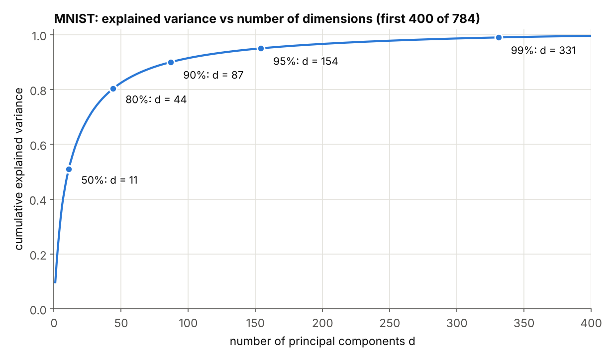
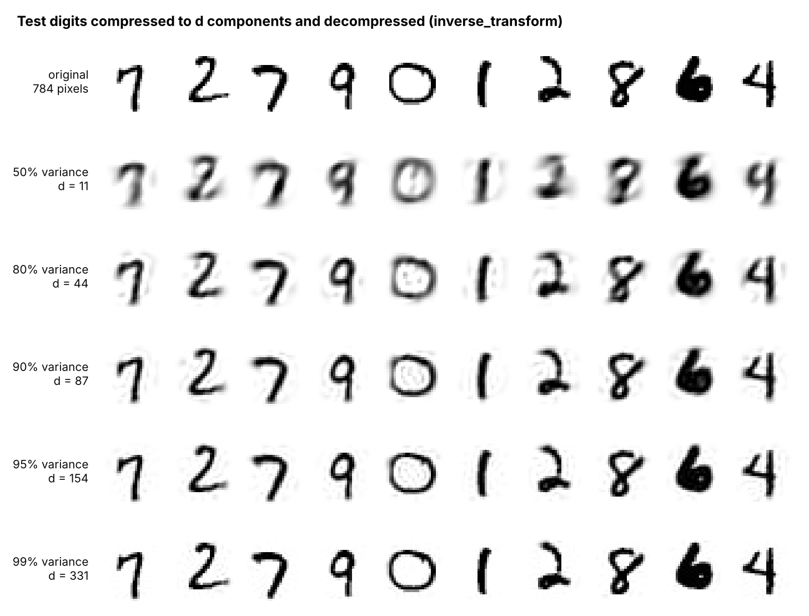
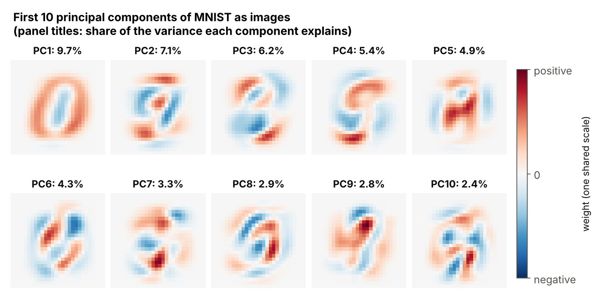

## B. Scaling PCA: Randomized, Incremental and out-of-core

154 components of the 188 MB float32 training matrix. scikit-learn's `svd_solver="auto"` picked **`covariance_eigh`** here.

| solver | algorithm | data | fit_seconds | runs | peak_fit_memory_MB | total_RAM_MB | explained_variance | test_mse | mse_vs_exact_pct |
|---|---|---|---|---|---|---|---|---|---|
| PCA, full SVD | full | in RAM | 3.17 | 3 | 381 | 569 | 0.9502 | 214.7 | +0.00% |
| PCA, solver='auto' | covariance_eigh | in RAM | 0.33 | 3 | 27 | 215 | 0.9502 | 214.7 | -0.00% |
| Randomized PCA | randomized | in RAM | 2.69 | 3 | 307 | 495 | 0.9498 | 215.8 | +0.52% |
| Incremental PCA, partial_fit | incremental | in RAM | 19.08 | 3 | 24 | 212 | 0.9495 | 216.5 | +0.81% |
| Incremental PCA, memmap + fit() | incremental | on disk (memmap) | 19.24 | 3 | 212 | 212 | 0.9495 | 216.5 | +0.81% |
| Incremental PCA, memmap + partial_fit | incremental | on disk (memmap) | 18.75 | 3 | 24 | 24 | 0.9495 | 216.5 | +0.81% |

* Randomized PCA and Incremental PCA find practically the same subspace: test MSE +0.52% and +0.81% versus the exact SVD.
* **Out-of-core:** feeding memmap slices to `partial_fit` needs at most 24 MB, about 24x less than full SVD with the data in RAM (569 MB).
* How memory is measured: peak NumPy/Python heap allocations during `fit` (`tracemalloc`), plus the training matrix when it is held in RAM. Pages of the memory-mapped file are not counted (the operating system can drop them at any time), and neither are the BLAS library's own small internal buffers.
* The book's recipe, `IncrementalPCA(...).fit(memmap)`, peaked at 212 MB. `fit()` validates and copies its whole input first (`copy=True`), so the data ends up in RAM anyway. Use `partial_fit` on slices.

| n_train | Incremental PCA, partial_fit | PCA, full SVD | PCA, solver='auto' | Randomized PCA |
|---|---|---|---|---|
| 5,000 | 1.933 | 0.3748 | 0.423 | 0.4126 |
| 10,000 | 3.797 | 0.5967 | 0.1056 | 0.7866 |
| 20,000 | 6.674 | 1.041 | 0.1609 | 1.304 |
| 40,000 | 12.25 | 1.993 | 0.2258 | 2.279 |
| 60,000 | 19.53 | 2.851 | 0.3301 | 2.784 |

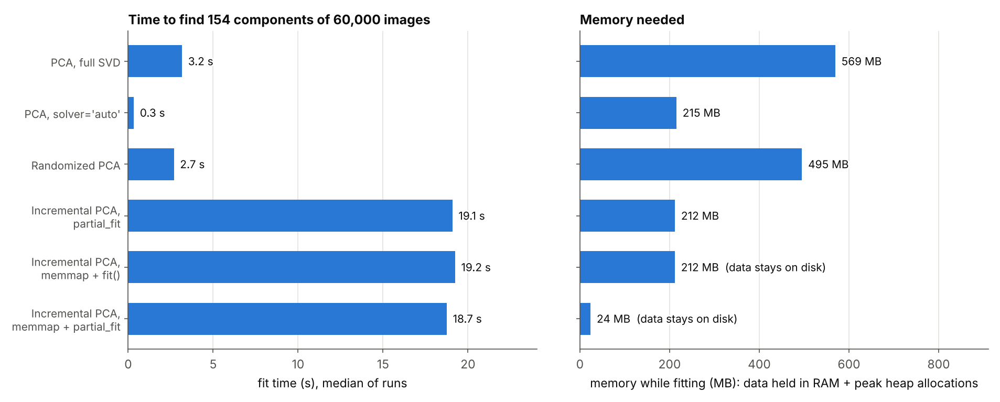
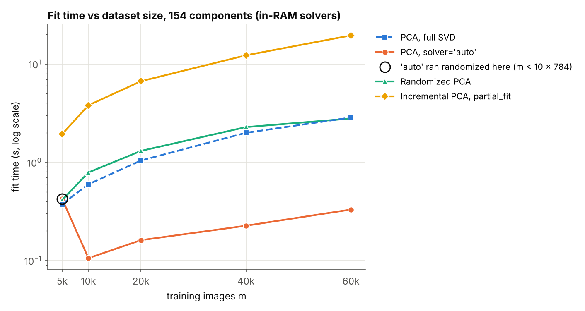

## C. Kernel PCA and manifold learning (Swiss roll, 1,000 points, 25% held out)

* **Supervised selection** (GridSearchCV over 20 kernel/gamma settings, kPCA -> Logistic Regression, training points only): **rbf, gamma = 0.0411**, CV accuracy 96.1% ± 1.0%, held-out accuracy **96.4%**. 7 settings are within one standard deviation of the best, so the exact gamma is not significant: any RBF gamma in the upper half of the grid works. Logistic Regression on the raw 3D points gets 64.8%, after linear PCA to 2D 75.2%.
* **Unsupervised selection** (lowest 3-fold cross-validated pre-image error, training points only): **sigmoid, gamma = 0.0478**, pre-image MSE 21.76. The same pipeline with this setting reaches only **73.6%** on the held-out points, close to linear PCA (75.2%). With such a small gamma the sigmoid kernel tanh(gamma x.x' + 1) is close to linear, so it rebuilds the inputs well but does not unroll the roll. The two rules answer different questions.
* Reproduction check: the book's setting (rbf, gamma = 0.0433, fitted and measured on all 1,000 points, as in the book) gives a pre-image MSE of **32.7863**; the book prints 32.786. (This in-sample number is not comparable with the cross-validated errors above.)

Top 5 settings by CV accuracy:

| kernel | gamma | cv_accuracy | cv_std |
|---|---|---|---|
| rbf | 0.0411 | 0.961 | 0.010 |
| rbf | 0.0433 | 0.960 | 0.006 |
| rbf | 0.0456 | 0.960 | 0.006 |
| rbf | 0.0500 | 0.959 | 0.004 |
| rbf | 0.0478 | 0.959 | 0.004 |

Top 5 settings by cross-validated pre-image error:

| kernel | gamma | fit_preimage_mse | cv_preimage_mse |
|---|---|---|---|
| sigmoid | 0.0478 | 21.28 | 21.76 |
| sigmoid | 0.0500 | 21.43 | 21.76 |
| sigmoid | 0.0456 | 21.17 | 21.78 |
| sigmoid | 0.0433 | 21.08 | 21.84 |
| sigmoid | 0.0411 | 21.03 | 21.94 |

Manifold methods on the whole roll (accuracy = 3-fold CV of StandardScaler -> Logistic Regression on the 2D embedding, predicting which half of the roll a point is on):

| method | seconds | downstream_accuracy | max_abs_corr_with_t |
|---|---|---|---|
| PCA | 0.00 | 0.716 | 0.219 |
| Kernel PCA (rbf) | 0.09 | 0.964 | 0.461 |
| LLE | 0.07 | 0.982 | 0.997 |
| Isomap | 0.15 | 0.992 | 0.992 |
| MDS | 1.90 | 0.751 | 0.179 |
| t-SNE | 2.32 | 0.987 | 0.904 |

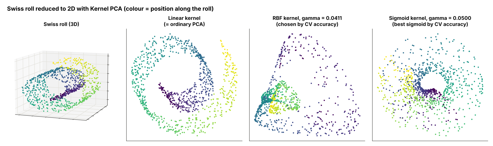
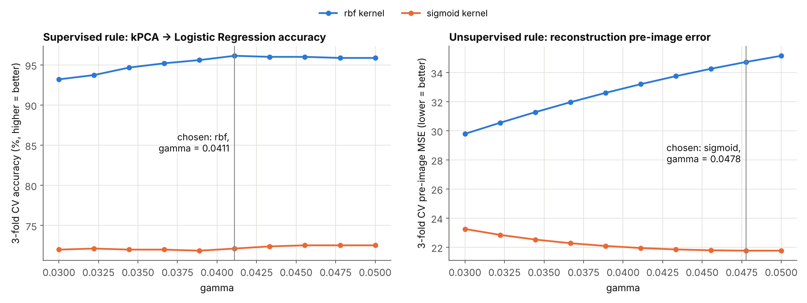
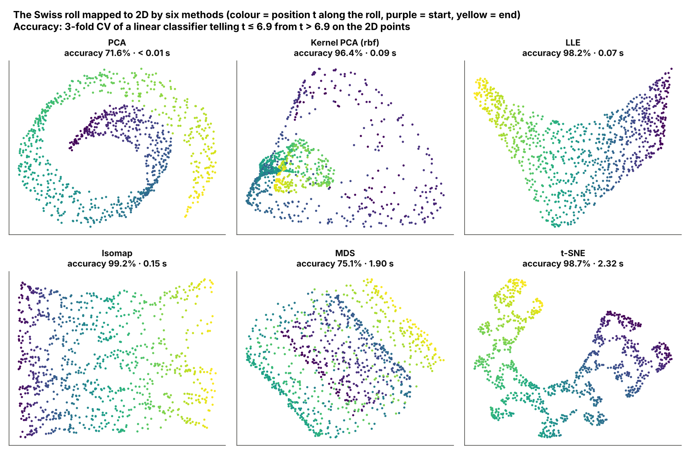

## D. Visualising MNIST in 2D (5,000 training digits)

kNN accuracy in 2D = 5-fold CV accuracy (± std over folds) of a 5-nearest-neighbours classifier on the 2D coordinates. Nonlinear methods run after PCA to 95% variance. The maps are fitted on all 5,000 points (t-SNE and MDS cannot map new points), so this score describes how well each map separates the digits; it is not a held-out classifier accuracy. Reference: the same kNN on all 784 pixels scores 92.8% ± 0.7%.

| method | seconds | knn_accuracy_2d | knn_std |
|---|---|---|---|
| PCA | 0.2 | 0.414 | 0.014 |
| Kernel PCA | 1.3 | 0.407 | 0.019 |
| LLE | 5.3 | 0.682 | 0.012 |
| Isomap | 5.9 | 0.504 | 0.016 |
| MDS | 190.5 | 0.453 | 0.008 |
| t-SNE | 16.5 | 0.933 | 0.009 |
| t-SNE (raw pixels) | 16.7 | 0.929 | 0.008 |

* **t-SNE separates the digits best (93.3% kNN accuracy in 2D vs 41.4% for PCA)**, on a par with a kNN on all 784 pixels (92.8%). This flatters t-SNE a little: the map was built with every point, including the ones each fold tests on.
* Running PCA first costs nothing: t-SNE on the raw pixels scores 92.9% in 16.7 s, against 93.3% in 16.5 s after PCA.

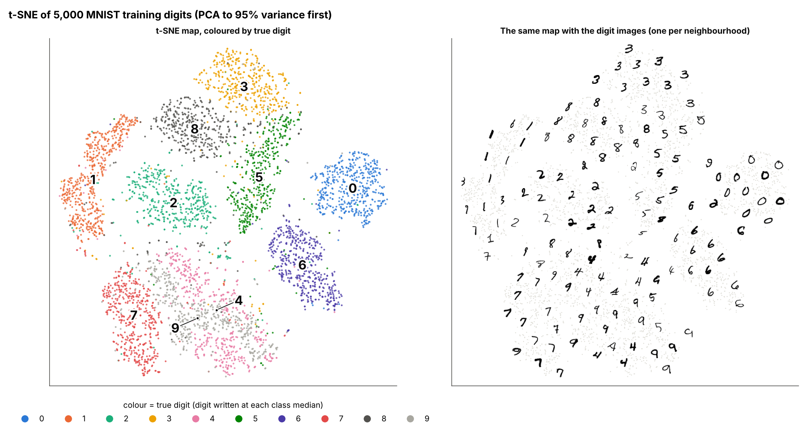
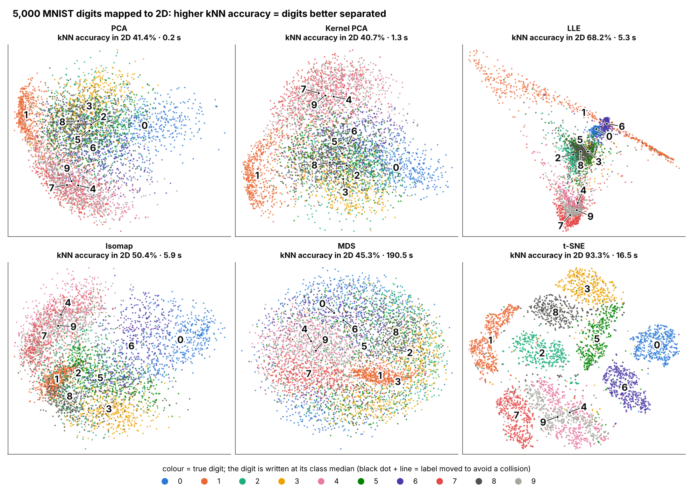

## E. Does compression speed up classification? (exercise 9)

The PCA (95% of the variance) is fitted on all 60,000 training images (it is unsupervised) and its fit time is included. Timings are medians of 3 runs (one run for fits slower than 60 s). Accuracy intervals are 95% t-intervals on the per-image correctness of the 10,000 test images (Geron, Ch. 2); "pca_same_gamma" is the PCA SVM run with the raw model's RBF bandwidth.

| classifier | features | n_features | n_train | fit_seconds | fit_runs | predict_seconds_10k | test_accuracy | accuracy_ci_low | accuracy_ci_high | model_MB |
|---|---|---|---|---|---|---|---|---|---|---|
| Softmax Regression | raw | 784 | 60,000 | 34.1 | 3 | 0.01 | 0.9264 | 0.9213 | 0.9315 | 0.0 |
| Softmax Regression | pca | 154 | 60,000 | 4.1 | 3 | 0.04 | 0.9232 | 0.9180 | 0.9284 | 0.5 |
| Random Forest | raw | 784 | 60,000 | 29.8 | 3 | 0.27 | 0.9705 | 0.9672 | 0.9738 | 146.1 |
| Random Forest | pca | 154 | 60,000 | 72.1 | 1 | 0.24 | 0.9495 | 0.9452 | 0.9538 | 212.8 |
| SVM (RBF kernel) | raw | 784 | 20,000 | 22.9 | 3 | 26.21 | 0.9701 | 0.9668 | 0.9734 | 39.3 |
| SVM (RBF kernel) | pca | 154 | 20,000 | 8.7 | 3 | 9.88 | 0.9748 | 0.9717 | 0.9779 | 8.6 |
| SVM (RBF kernel) | pca_same_gamma | 154 | 20,000 | 7.6 | 3 | 9.07 | 0.9713 | 0.9680 | 0.9746 | 8.2 |

* **softmax**: training 8.35x and prediction 0.21x faster with PCA (>1 = faster); accuracy -0.32 pp (paired 95% CI -0.61 to -0.03 pp).
* **random forest**: training 0.41x and prediction 1.11x faster with PCA (<1 = slower); accuracy -2.10 pp (paired 95% CI -2.46 to -1.74 pp).
* **svm**: training 2.63x and prediction 2.65x faster with PCA (>1 = faster); accuracy +0.47 pp (paired 95% CI +0.31 to +0.63 pp).
* **SVM bandwidth ablation:** with the raw model's gamma, the PCA SVM scores 97.13% (+0.12 pp vs raw, 95% CI +0.01 to +0.23 pp). Most of the PCA model's accuracy gain therefore comes from `gamma="scale"` choosing a different kernel width on the PCA features; the part due to dropping the 630 low-variance directions alone is small and only just significant.
* The deployed pair is the **svm**: raw pixels 97.01%, PCA features 97.48%.

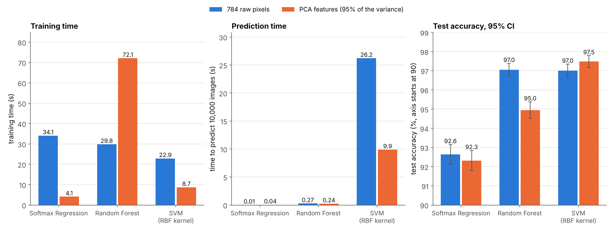

## F. Flagging unusual inputs by reconstruction error

PCA with 154 components; threshold = the 96th percentile of reconstruction errors on 10,000 held-out training images = **427.0**.

* False alarms on the 10,000 clean test digits: **3.34%** (95% CI 2.99-3.69%; target 4%, the book's rule of thumb, not a cost-based choice). With the threshold set on the fitting images instead: 3.66%. With 50,000 fitting images PCA hardly overfits, so the two thresholds are close (427 vs 420). Both give fewer than 4% false alarms because MNIST's test digits are rebuilt slightly better than its training digits (test MSE 214.7 vs training 217.8).
* Mean detection over 8 synthetic corruption types: 65.0%; ROC-AUC clean vs corrupted: 0.791. These averages depend on which corruptions are included; the per-type rates below are the informative numbers. No real out-of-distribution data (letters, other image sets) is tested.
* Served classifier (svm, PCA features) on clean test digits: error rate **6.0%** on the 334 flagged images vs **2.4%** on the rest (20 of its 252 errors are flagged).

| input | flagged_pct | median_error |
|---|---|---|
| clean test digits | 3.3% | 198 |
| noise | 100.0% | 10,908 |
| inverted | 100.0% | 26,459 |
| shuffled | 100.0% | 5,297 |
| rotated | 12.7% | 246 |
| mirrored | 17.2% | 269 |
| shifted | 90.2% | 1,119 |
| gaussian | 100.0% | 2,231 |
| dimmed | 0.0% | 18 |

Threshold sweep:

| flag_rate_pct | threshold | clean_false_alarm_pct | mean_detection_pct |
|---|---|---|---|
| 1 | 542.6 | 0.85 | 61.9 |
| 2 | 488.8 | 1.68 | 63.2 |
| 4 | 427.0 | 3.34 | 65.0 |
| 6 | 387.7 | 5.37 | 66.5 |
| 8 | 365.3 | 6.89 | 67.6 |
| 10 | 346.5 | 8.46 | 68.6 |

How many components should the detector keep?

| variance | n_components | clean_false_alarm_pct | mean_detection_pct | roc_auc |
|---|---|---|---|---|
| 80% | 44 | 2.84 | 67.0 | 0.819 |
| 90% | 87 | 3.12 | 66.3 | 0.806 |
| 95% | 154 | 3.34 | 65.0 | 0.791 |
| 99% | 331 | 3.67 | 65.5 | 0.786 |

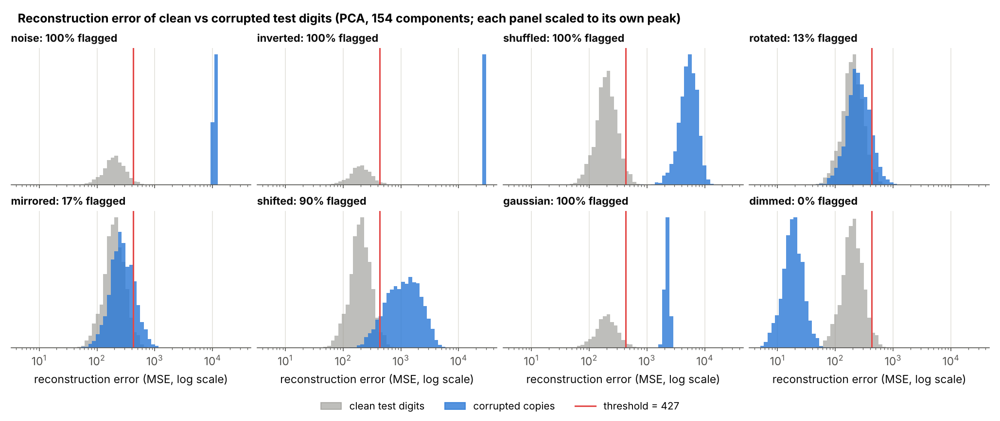
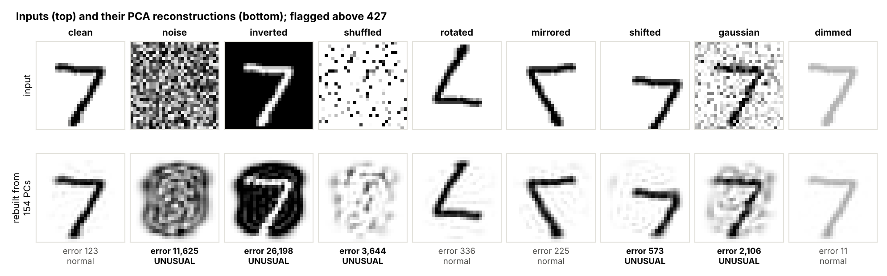
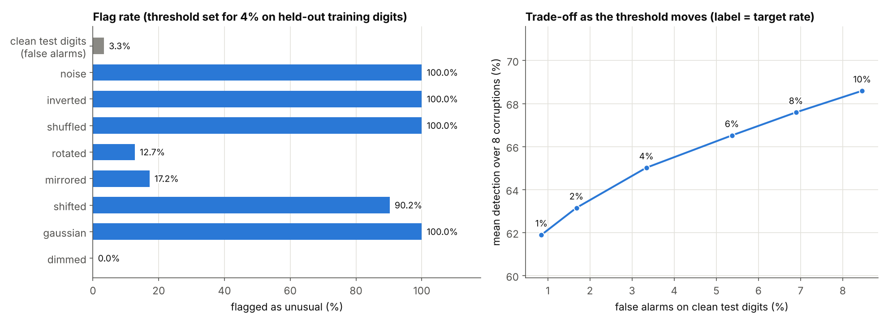
